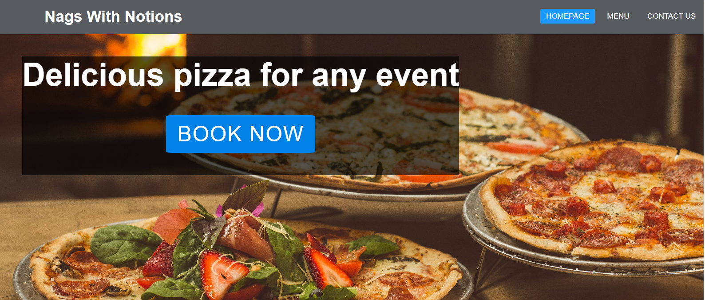

<!-- Inspiration for readme layout taken from Iceland the land of fire and Ice provided by Institute Mentor Anthony -->

# Contents

## [Introduction](#nags-with-notions) 
## [User Experience (UX)](#user-experience)
## [Design] (#design)
## [Features](#features)
## [Menu-Page](#menu)

# Nags-with-Notions

Nags with Notions is a website that hopes to inform customers about the delicious
pizzas on offer. The aim is to attract customers to purchase pizzas by having
the site look appealing and easy to use. Information such as opening times, menu,location
and how to pre-book pizzas is included. Links to Nags with Notions social media accounts 
are provided. The code behind this section was heavily reliant on the Love Running Club navigation section in the Code Institute tutorial.

# User-Experience

## As a new visitor

I would like to understand what the product is
I would like to be able to find information on the website easily
I would like to know the menu, contact, prices, location and opening times
I would like social media links to other content by the supplier

## As a returning visitor

I would like to be able to give feedback on the product
I would like to see any updates on the menu or venue location

# Design (UXD)

## Strategy

Recently, the pizzeria went from staying in the one location (behind a pub) to going whereever
there's a demand. 

The mobile pizzeria has since received many requests from different venues: festivals, weddings, concerts etc. 

Due to the mobile nature of the business the pizzeria needs a strong online presence so people
can be informed about their services. 

By having a responsive, easy to use website Nags with Notions hopes users can see exactly what's on offer and are enticed to acquire Nags with Notions services. 

## Scope

## Structure

## Skeleton

# Wireframe

An initial blueprint of the project was created using balsamiq wireframes. This wireframe
was presented to ones mentor Anthony during the first of three meet ups. 

[wireframe](wireframe/Nags-With-Notions-Wireframe.png)

## Surface

### Colour Palette

The colour palette was generated using coolors.com. The colours match those of 
the Nags with Notions logo.

# Features

## Navigation Bar

On all 3 pages there is a link to the Home page, menu and feedback form. 
This allows for easier navigation between the pages.
As the screen decreases in width the navigation buttoms go underneath the main heading.
A line appears under the navigation buttons, when hoovered over. The text remains underlined 
for the current page. 

## Hero Image

Large image of pizzas to give viewers familiarity with the product.
This image will catch their attention. he book now button is conviently placed here to increase the purchase times. 

## About section

The about section gives the site a homily feel. By showing the converted horsebox and images of the two girls viewers get a feel for the pizzeria and the owners personalities. 

## Reviews

The reviews section provides validation for users that the product on offer is of high quality and has received great feedback from the public. This assures viewers about their purchase. 

## Video

Video taken from youtube. This video was implemented to give viewers a feel for the natural style of making pizzas, which hopefully will remind them why home baked meals are better than something you would buy in a store. 

## Footer

The footer section has links to Nags with Notions facebook, instagram and twitter social media accounts.

## Menu

This page allows viewers to see the produce on offer and prices. 

## Contact Us

This page allows viewers to contact the owners for information or to avail of their services.

# Testing

--------------

## Validator Testing

11 errors were found on the main page upon running the deployed website through the W3C HTML validator.

After addressing all 11 issues a re-run of the site through the WC3 validator found no errors.

1 error found for all pages when the site was deployed through the css W3C validator

#Performance Testing

Google Chromes Lighthouse tool was used to measure the sites performance. 

Lighthouse highlighted how the sites responsiveness was being compromised by not having images compressed or at the correct sizes for certain devices. 

For the menu page Lighthouse highlighted how some of the images were distorted and that the social media icons had poor accessability. 

-------------------

## Bugs

# Solved bugs

When using media query to adapt the screensize to mobiles the logo would not drop down correctly. The formating of the logo and surrounding text had to be changed to address this. Tutor support was required.

Images would not upload on the readme, as their were gaps in the image names. Tutor support was required. 

# Unfixed bugs

# Deployment

The site was deployed on github pages. 

Live link: [Nags-with-Notions](<https://jwalshe86.github.io/Nags-With-Notions/index.html>)

------------------------------------

# Credits

## Content

The font styles in the heading were taken from [google fonts](<https://fonts.google.com/specimen/Permanent+Marker?query=perm>)

Images were compressed on TinyPNG <https://tinypng.com/>

The layout of the Readme page was taken from davidcalikes <https://github.com/davidcalikes/portfolio-project-one/blob/main/README>

Template for reviews section from fellow student Roisin O'Connell <https://github.com/roc-11/max-rehab>

The template for the responsive navigation 
was taken from Coding Nepal Youtube Responsive Navigation Bar. <https://youtu.be/oLgtucwjVII>

The template for the hero image was taken from Code Institutes Love Running module.

The Hero Image Cover text template was taken from Daniel Zuzevich <https://youtu.be/QA8yjuS9CQg>

For the 'About' section: How to use flexbox columns was taken from youtubes SyntaxByte: CSS Flexbox Columns <https://youtu.be/C4XCGwUkOOo> and Codehal How to align Image text side by side in html & css <https://youtu.be/lgX38fNbxmw>

The template for the menu items was taken from Abdullah Nahian: Create a Restaurant Menu using CSS, HTML & Flexbox
 https://youtu.be/OF9ByGKxGT4

The template for the footer was taken from Cem Eygi Media YouTube Responsive Footer with CSS Flexbox <https://youtu.be/VUydBuotmR4>

text input styling template for contact form taken from W3Schools  
https: //www.w3schools.com/howto/howto_css_contact_form.asp

Feedback from my mentor Anthony

Feedback on the Slack peer review page from fellow student Joseph O'Connell

Support from Code Institute Tutors

## Media

Video on homepage was taken from Youtube.
https://www.youtube.com/embed/kPk9r9zg5nE

All images were taken from pexels.com except for the about image which was taken from the Nags With Notions Instagram

