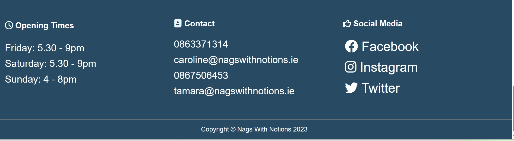
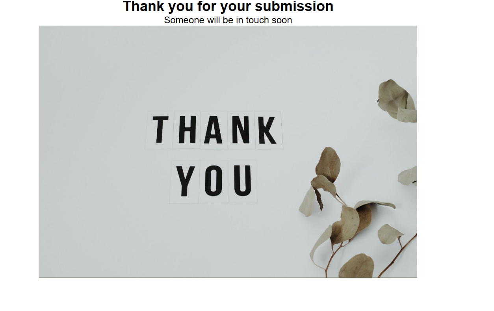

<!-- Inspiration for readme layout taken from Iceland the land of fire and Ice provided by Institute Mentor Anthony & davidcalikes which was presented on the Slack class page as best practice and Kera Cudmore "Creating your first readme" https://youtu.be/XbYJ4VlhSnY-->

# Nags-with-Notions

Nags with Notions is a website that hopes to inform customers about the delicious
pizzas on offer. The aim is to attract customers to purchase pizzas by having
the site look appealing and easy to use. Information such as opening times, menu, 
 location
and how to pre-book pizzas is included. Links to Nags with Notions social media accounts are provided.
<!--The code behind this section was heavily reliant on the Love Running Club navigation section in the Code Institute tutorial. -->
 

[View the live site here.](https://jwalshe86.github.io/Nags-With-Notions/)

## Contents

- [Nags-with-Notions](#nags-with-notions)
  - [Contents](#contents)
- [User-Experience](#user-experience)
  - [As a new visitor](#as-a-new-visitor)
  - [As a returning visitor](#as-a-returning-visitor)
- [Design UXD](#design-uxd)
  - [Strategy](#strategy)
  - [Scope](#scope)
  - [Structure](#structure)
    - [Landing Page](#landing-page)
    - [Menu](#menu)
    - [Contact page](#contact-page)
- [Technologies Used](#technologies-used)
  - [Languages Used](#languages-used)
  - [Frameworks, Libraries \& Programs Used](#frameworks-libraries--programs-used)
  - [Skeleton](#skeleton)
- [Wireframe](#wireframe)
  - [Surface](#surface)
    - [Colour Palette](#colour-palette)
  - [Typography](#typography)
    - [Imagery](#imagery)
    - [Iconography](#iconography)
    - [Accessability](#accessability)
- [Features](#features)
  - [Navigation Bar](#navigation-bar)
  - [Hero Image](#hero-image)
  - [About section](#about-section)
  - [Reviews](#reviews)
  - [Video](#video)
  - [Footer](#footer)
  - [Menu](#menu-1)
  - [Contact Us](#contact-us)
- [Testing](#testing)
  - [Validator Testing](#validator-testing)
  - [Bugs](#bugs)
- [Solved bugs](#solved-bugs)
- [Unfixed bugs](#unfixed-bugs)
- [Deployment](#deployment)
- [Credits](#credits)
  - [Content](#content)
  - [Media](#media)

# User-Experience

## As a new visitor

I would like to understand what the product is
I would like to be able to find information on the website easily
I would like to know the menu, contact, prices, location and opening times
I would like social media links to other content by the supplier

## As a returning visitor

I would like to see updates in the menu and pricing. 

# Design UXD

## Strategy

Recently, the pizzeria went from staying in the one location (behind a pub) to going whereever
there's a demand. 

The mobile pizzeria has since received many requests from different venues: festivals, weddings, concerts etc. 

Due to the mobile nature of the business the pizzeria needs a strong online presence so people
can be informed about their services. 

By having a responsive, easy to use website Nags with Notions hopes users can see exactly what's on offer and are enticed to acquire Nags with Notions services. 

## Scope

The scope covered the needs of the customers and ensuring these needs were met. 

The site provides customers with an explanation of the service and what's on offer. The customer can easily nagivatie through the website to find information. The main constraints are only css and html could be used, the authors inexperience and the time-limit. Another constraint was the lack of high quality images of the Nags with Notions pizzeria. 

## Structure

### Landing Page

- Nav bar with links to home, menu and contact page.
- Hero Image with title and subtitle overlay & booking button.
- About section covering the venue and two owners. 
- Some customer reviews
- A video of pizza being cooked in a horsebox.
- Footer with social media links, contact and opening times info. 

### Menu

- Nav bar with links to other pages.
- Background image of pizzas.
- Menu with image of each item.
- Footer with social media links, contact and opening times info.

### Contact page

- Nav bar with links to other pages.
- Background image of couple ordering something.
- Form where customers can enter a message with their details. 
- Footer with social media links, contact and opening times info.

# Technologies Used

## Languages Used

HTML and CSS were used to create the website.

## Frameworks, Libraries & Programs Used

Balsamiq - used for wireframes.

Git - For version control.

Github - To save and store info for the website. 

Shields from shields.io

The font styles in the heading were taken from [google fonts](<https://fonts.google.com/specimen/Permanent+Marker?query=perm>)

Images were compressed on [TinyPNG](<https://tinypng.com/>).

Google Dev Tools was routinely used to test code.

The responsiveness of the website was checked on [Am I Responsive](https://ui.dev/amiresponsive).

The [Web Access Evaluation Tool](https://wave.webaim.org/) was used to assess the websites accessability. 

[Code Beautify](https://codebeautify.org/) was used to clean up the code alignment . 

## Skeleton

# Wireframe

An [initial-blueprint](assets/images/readme-images/wireframe4.png) of the project was created using balsamiq wireframes. This wireframe was presented to ones mentor Anthony during the first of three meet ups. The styling and layout significantly changed as the project progressed but the core structure remained.

## Surface

### Colour Palette

The colour palette was generated using coolors.com. The colours used were warm and relaxing just like Nags with Notions. 

The main color used was #284b63 or dark blue. It was felt that this color was elegant and made the page look classy. 

#d9d9d9 or grey was used in the about section. This color complemented the dark blue, as per color palette above. 

The reviews and video section were left as white, as this complemented both the grey and dark blue and gave a light feel to this area of the page. 

The black background cover on botht the main title and pizza menu titles are 20% transparant. This is so the images of pizza behind the text can be viewed. The black and white is to aid accessability. 

## Typography

The font used was Open Sans, which is specifically used for its legibility. 

### Imagery 

The hero image is a picture of 3 delicious pizzas. This is to entice the customer and immediately show what's on offer. The image of the food truck and two owners below this gives a homely feel to the Landing Page. The background of the menu is a delicious pizza, again to entice customers. The background of the contact page is a couple applying happily online for the pizzas.

All the images came from Pexels.com except one. The 3 pizza hero image was taken by 
[Narda-Yescas](<https://www.pexels.com/@narda-yescas-724842/>). 
[Vincent-Rivaud](https://www.pexels.com/@vince/) the blue cheese and gormet fries images. [CoolShooters](https://www.pexels.com/@koolshooters/) took the images of both 'Tamara' and 'Caroline' eating pizza in the about section. [Geraud-Pfeiffer](https://www.pexels.com/@geraud-pfeiffer/) the nachos. [Ahmed-Rabea](<https://www.pexels.com/@ahmed-rabea-2883687/>) the toasted sandwich. [Andrea-Picquadio](<https://www.pexels.com/@olly/>) the couple booking something image. The image of the pizza truck came from istockphotos.com and is credited to [Maica](https://www.istockphoto.com/portfolio/Maica?mediatype=photography). 

### Iconography

The company logo  was taken from the Nags with Notions FB page. 
The hamburger menu for smaller screens  and social media icons  came from fontawesome.com.
 

 ### Accessability

The [Web Access Evaluation Tool](https://wave.webaim.org/) was used to assess the websites accessability. 

The report found that the logo label was missing content for the screenreader. This was then corrected. 

 

 The report also found that the main title and the booking buttons in the menu page didn't have enough contrast. This was then corrected. 

  

# Features

## Navigation Bar

On all 3 pages there is a link to the Home page, menu and feedback form. 
This allows for easier navigation between the pages. Clicking on the Nags with Notions title also brings one to the home page. 

As the screen decreases in width a clickable dropdown menu is presented. 

## Hero Image

Large image of pizzas to give viewers familiarity with the product.
This image will catch their attention. The book now button is conviently placed here to increase the purchase times. 

## About section

The about section gives the site a homily feel. By showing the converted horsebox and images of the two girls viewers get a feel for the pizzeria and the owners personalities. 

## Reviews

The reviews section provides validation for users that the product on offer is of high quality and has received great feedback from the public. This assures viewers about their purchase. 

## Video

Video taken from youtube. This video was implemented to give viewers a feel for the natural style of making pizzas, which hopefully will remind them why home baked meals are better than something you would buy in a store. 

## Footer

The footer section has links to Nags with Notions facebook, instagram and twitter social media accounts. It also has opening times and contact information. 

The footer is responsive in that the information is displayed vertically on smaller devices. 

## Menu

This page allows viewers to see the produce on offer and prices. 

When one hovers over the food images they change from square to oval. This is just a nice feature to further attain viewers attention towards what's on offer.

The pizza menu is responsive to mobile devices. Using flex the menu items are presented in a single column. 

## Contact Us

This page allows viewers to contact the owners for information or to avail of their services. An image of a couple happily ordering in the background is presented. 

Upon submission viewers are brought to a thank you page 

# Testing

The website was tested on three browsers: 

- [microsoft edge test](assets/images/readme-images/microsoft-edge-test.png)
- [chrome test](assets/images/readme-images/chrome-test.png)
- [firefox test](assets/images/readme-images/firefox-test.png)

The site was fully function on all browsers. 

Chrome Developer Tools are used to test the responsiveness on: Laptop, Galaxy A51/71, iPhone 5/SE, iPad mini, iPad Air, Galaxy Fold.
- [Laptop Test](assets/images/readme-images/responsive-tests/laptop-test.png)
- [Galaxy A51/71 Test](assets/images/readme-images/responsive-tests/Samson-Galaxy-A5171-test.png)
- [Iphone 5/SE Test](assets/images/readme-images/responsive-tests/iphone-SE-test.png)
- [ipad mini Test](assets/images/readme-images/responsive-tests/ipad-mini-test.png)
- [ipad Air Test](assets/images/readme-images/responsive-tests/ipad-air-test.png)
- [Galaxy Fold Test](assets/images/readme-images/responsive-tests/Galaxy-fold-test.png)

Upon the Galaxy Fold test which is only 280 px wide teh images were set to max-width 300px and not fitting into the viewport. 

--------------

## Validator Testing

11 errors were found on the main page upon running the deployed website through the W3C HTML validator.

[validator-testing-1](assets/images/readme-images/validator-testing-1.png)

[validator-testing-2](assets/images/readme-images/validator-testing-2.png)

[validator-testing-3](assets/images/readme-images/validator-testing-3.png)

After addressing all 11 issues a re-run of the site through the WC3 validator found no errors.

[post-validator-test](assets/images/readme-images/post-validation-test.png)

[validator-test-menu-1](assets/images/readme-images/html-menu-validator-test1.png)

[validator-test-menu-2](assets/images/readme-images/html-menu-validator-test-2.png)

1 error found for all pages when the site was deployed through the css W3C validator

[css-validation-test](assets/images/readme-images/css-validator-testing.png)

#Performance Testing

Google Chromes Lighthouse tool was used to measure the sites performance. 
[Lighthouse-review](assets/images/readme-images/lighthouse-performance.png)

Lighthouse highlighted how the sites responsiveness was being compromised by not having images compressed or at the correct sizes for certain devices. For the menu page Lighthouse highlighted how some of the images were distorted and that the social media icons had poor accessability. 

[lighthouse-home-post-edits](assets/images/home-post-edit-lighthouse.png)

[lighthouse-contact-post-edits](assets/images/readme-images/contact-post-lighthouse-edits.png)

The deployed website was also posted on Slacks peer-review-channel. Colleagues helped highlight performance issues and the correction of a blurry image. Thanks [Derek King](https://github.com/dkingDev) for showing I should add object-fit: cover and change the height to % instead of px, to fix an issue with a blurry image. Thanks [Julia Wagner](https://github.com/Julia-Wagner) and [Joseph O'Connell](https://github.com/JosephOConnell) for your feedback too.

-------------------
## Bugs

# Solved bugs

When using media query to adapt the screensize to mobiles the logo would not drop down correctly. The formating of the logo and surrounding text had to be changed to address this. Tutor support was required.

Images would not upload on the readme, as their were gaps in the image names. Tutor support was required. 

# Unfixed bugs

# Deployment

The site was deployed on github pages. 

Live link: [Nags-with-Notions](<https://jwalshe86.github.io/Nags-With-Notions/index.html>)

One clicked on settings within the Nags-with-Notions github repository. One pressed settings and went into the pages section. Under 'Build & Deployment' the source was branch. The branch was main and folder root. Initially the website wouldn't deploy and it was felt something was wrong. However after 10 minutes a link to the deployed website appeared on the top of the Pages page. When the site was first opened none of the images were present. After contacting a tutor it was found that the relative path ie ./ was required instead of the local. Once all the images were changed to relative they then showed on the deployed website. 

------------------------------------

# Credits

## Content

The layout of the Readme page was taken from [davidcalikes](<https://github.com/davidcalikes/portfolio-project-one/blob/main/README>)  and [Kera Cudmore]( <https://youtu.be/XbYJ4VlhSnY>) "Creating your first readme".

Code for reviews section from fellow student [Roisin O'Connell](<https://github.com/roc-11/max-rehab>) 

The code for the responsive navigation 
was taken from [Coding Nepal](<https://youtu.be/oLgtucwjVII>) Youtube Responsive Navigation Bar.

The code for the hero image was taken from Code Institutes Love Running module.

The Hero Image Cover text code was taken from [Daniel Zuzevich](<https://youtu.be/QA8yjuS9CQg>) 

For the 'About' section: How to use flexbox columns code was taken from youtubes [SyntaxByte: CSS Flexbox Columns](<https://youtu.be/C4XCGwUkOOo>)  and [Codehal](<https://youtu.be/lgX38fNbxmw>) How to align Image text side by side in html & css

The code for the menu items was taken from [Abdullah Nahian: Create a Restaurant Menu using CSS, HTML & Flexbox](https://youtu.be/OF9ByGKxGT4)
 

The code for the footer was taken from [Cem Eygi Media YouTube Responsive Footer with CSS Flexbox](<https://youtu.be/VUydBuotmR4>)

The text input styling code for contact form taken from [W3Schools](https://www.w3schools.com/howto/howto_css_contact_form.asp)  

Idea for [thank-you-submission-page](https://stackoverflow.com/questions/1438722/thank-you-alert-upon-form-submission) came from StackoverFlow. 

Feedback from my mentor Anthony Yugwu

Support from Code Institute Tutors

My wife and family as I embark on this new career 

Caroline and Tamara for allowing me create a website for them, which they've just asked if it can be put online. I just need to figure out some javascript first but getting there!

## Media

Video on homepage was taken from Youtube: [The Curly Stu](https://www.youtube.com/embed/kPk9r9zg5nE)

All images were taken from pexels.com, except for one from istockphotos.com

