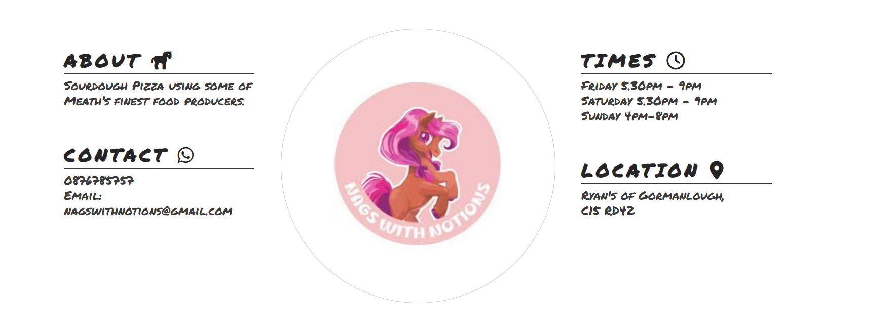

<!-- Inspiration for readme layout taken from Iceland the land of fire and Ice provided by Institute Mentor Anthony -->

# Contents

## [Introduction](#nags-with-notions) 
## [User Experience (UX)](#user-experience)
## [Features](#features)
## [Menu-Page](#menu)

# Nags-with-Notions

Nags with Notions is a website that hopes to inform customers about the delicious
pizzas on offer. The aim is to attract customers to purchase pizzas by having
the site look appealing and easy to use. Information such as opening times, menu,location
and how to pre-book pizzas is included. Links to Nags with Notions social media accounts 
are provided. The code behind this section was heavily reliant on the Love Running Club navigation section in the Code Institute tutorial.

# User-Experience

## As a new visitor

I would like to understand what the product is
I would like to be able to find information on the website easily
I would like to know the menu, contact, prices, location and opening times
I would like social media links to other content by the supplier

## As a returning visitor

I would like to be able to give feedback on the product
I would like to see any updates on the menu or venue location

# Features

## Navigation Bar

On all 3 pages there is a link to the Home page, menu and feedback form. 
This allows for easier navigation between the pages.
As the screen decreases in width the navigation buttoms go underneath the main heading.
A line appears under the navigation buttons, when hoovered over. The text remains underlined 
for the current page. 

## Hero Image

Large image of the pizza horse box to give viewers familiarity with the product.
This image will catch their attention.

## Relevant information section

This will allow viewers to obtain key information such as the location, contact and opening
times. The company logo will be presented here also. The code behind this section was heavily reliant on the Love Running Club ethos section in the Code Institute tutorial. 

## Footer

The footer section has links to Nags with Notions facebook, instagram and twitter social media accounts.

## Menu

This page allows viewers to see the produce on offer and prices. 

## Feedback

This page allows viewers to provide their feedback. 

# Testing

--------------

## Validator Testing

-------------------

## Bugs

# Solved bugs

When using media query to adapt the screensize to mobiles the logo would not drop down correctly. The formating of the logo and surrounding text had to be changed to address this. Tutor support was required.

Images would not upload on the readme, as their were gaps in the image names. Tutor support was required. 

# Unfixed bugs

# Deployment

------------------------------------

# Credits

## Content

The font styles in the heading were taken from [google fonts](<https://fonts.google.com/specimen/Permanent+Marker?query=perm>)

Image of pizza in front of open fire on main page was taken from [Pexels] (<https://images.pexels.com/photos/905847/pexels-photo-905847.jpeg?auto=compress&cs=tinysrgb&w=1260&h=750&dpr=1>)

## Media

